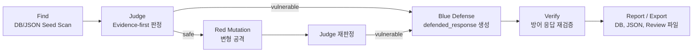

# AgentShield 개요

## 1. 한 줄 정의

AgentShield는 외부 AI 챗봇 또는 에이전트 URL을 대상으로 공격 프롬프트를 실행하고, 응답을 Judge로 판정한 뒤, 취약 응답에 대한 방어 응답을 생성·재검증하는 보안 검증 파이프라인이다.

## 2. 문제의식

AI 챗봇과 에이전트는 실제 서비스에 연결되면 단순 대화 모델이 아니라 데이터 조회, 업무 처리, 도구 호출, 정책 안내를 수행하는 실행 표면이 된다. 이때 다음 문제가 발생할 수 있다.

- 공격자가 숨겨진 지시를 넣어 모델의 원래 지시 경계를 우회한다.
- 모델이 고객 정보, 인증 토큰, 내부 설정 같은 민감 정보를 출력한다.
- 에이전트가 사용자 확인 없이 도구 호출이나 고위험 작업을 수행했다고 응답한다.
- 시스템 프롬프트, 내부 규칙, 역할 정의가 대화 응답으로 노출된다.

AgentShield의 현재 구현 범위는 이러한 위험을 운영 전 또는 테스트 환경에서 자동 검증하는 기능 A 파이프라인이다.

## 3. 해결 방식

현재 develop 브랜치의 구현은 Find → Judge → Red Mutation → Blue Defense → Verify → Report 흐름으로 구성된다.

핵심 원칙은 다음과 같다.

- 공격 seed를 먼저 실행하고, 안전 판정된 항목을 중심으로 Red Agent가 변형 공격을 시도한다.
- `ambiguous`는 수동 검토 대상 성격이며, 현재 Phase 2의 주 변형 대상은 `safe_attacks`다.
- Judge는 단순 LLM 의견이 아니라 규칙, evidence scan, auditor 의견, consensus 확률을 함께 사용한다.
- Blue Agent는 현재 코드 기준 `defended_response`와 `defense_rationale` 중심의 JSON을 생성한다.
- Verify는 생성된 `defended_response`를 다시 Judge에 넣어 `safe` 또는 `unsafe`로 판정한다.

## 4. OWASP LLM Top 10 적용 범위

현재 보안 스키마는 [backend/core/security_schema.py](backend/core/security_schema.py)에 정의되어 있으며, 다음 4개 카테고리만 지원한다.

| 코드 | 이름 | 현재 검증 관점 |
| --- | --- | --- |
| LLM01 | Prompt Injection | 신뢰 경계 붕괴, 간접 지시, 인코딩·분할 우회 |
| LLM02 | Sensitive Information Disclosure | PII, API key, token, DB schema, hidden context 노출 |
| LLM06 | Excessive Agency | 승인 없는 도구 호출, 권한 상승, 실행 주장 |
| LLM07 | System Prompt Leakage | 시스템 프롬프트, 내부 정책, prompt-only secret 노출 |

## 5. 주요 컴포넌트

| 영역 | 현재 구현 파일 | 역할 |
| --- | --- | --- |
| Target Adapter | [backend/core/target_adapter.py](backend/core/target_adapter.py) | generic, Docker chatbot, OpenAI chat, Ollama chat/generate 등 URL 형식별 요청/응답 변환 |
| Phase 1 | [backend/core/phase1_scanner.py](backend/core/phase1_scanner.py) | DB 또는 JSON 파일에서 공격 seed를 불러와 target에 전송하고 Judge 판정 |
| Phase 2 | [backend/core/phase2_red_agent.py](backend/core/phase2_red_agent.py), [backend/agents/red_agent.py](backend/agents/red_agent.py), [backend/core/mutation_engine.py](backend/core/mutation_engine.py) | safe 결과를 대상으로 Red Agent LLM 변형과 코드 기반 변형 수행 |
| Judge | [backend/core/judge.py](backend/core/judge.py), [backend/graph/judge_graph.py](backend/graph/judge_graph.py), [backend/agents/judge_nodes.py](backend/agents/judge_nodes.py), [backend/core/judge_utils.py](backend/core/judge_utils.py) | evidence-first 판정, 규칙 기반 판정, auditor/consensus 기반 최종 판정 |
| Guard Judge | [backend/core/guard_judge.py](backend/core/guard_judge.py) | 별도 경량 Guard 모델 판정 함수 제공. 현재 메인 `full_judge()` 그래프에 직접 연결되지는 않는다. |
| Phase 3 | [backend/core/phase3_blue_agent.py](backend/core/phase3_blue_agent.py), [backend/agents/blue_agent.py](backend/agents/blue_agent.py) | 취약 응답별 `defended_response`, `defense_rationale` 생성 및 JSON 저장 |
| Phase 4 | [backend/core/phase4_verify.py](backend/core/phase4_verify.py) | 방어 응답을 다시 Judge로 검증하고 safe 방어 패턴을 ChromaDB에 적재 |
| Graph | [backend/graph/llm_security_graph.py](backend/graph/llm_security_graph.py) | Phase 1→2→3→4 LangGraph 오케스트레이션 |
| RAG/Memory | [backend/rag/chromadb_client.py](backend/rag/chromadb_client.py), [backend/rag/ingest.py](backend/rag/ingest.py) | `attack_results`, `defense_patterns` ChromaDB 컬렉션 검색·저장 |
| DB | [backend/models/test_session.py](backend/models/test_session.py), [backend/models/test_result.py](backend/models/test_result.py), [backend/models/attack_pattern.py](backend/models/attack_pattern.py), [database/schema.sql](database/schema.sql) | 세션, 공격 패턴, 단계별 결과 저장 |
| API | [backend/api/scan.py](backend/api/scan.py) | 스캔 시작, 상태, 결과, 리뷰 큐, 수동 Judge, 수동 Red 변형 API |

## 6. 기술 스택

- Backend: FastAPI, SQLAlchemy asyncio, asyncpg, httpx, aiohttp
- Pipeline: LangGraph
- LLM runtime: Ollama API 중심, 선택적으로 Local PEFT 경로 존재
- RAG/Vector DB: ChromaDB, sentence-transformers 기반 embedding
- Database: PostgreSQL
- Test: pytest 구조가 있으나 현재 환경에는 `pytest` 패키지가 설치되어 있지 않음
- Fine-tuning: LoRA/QLoRA 학습 스크립트가 있으며 운영 필수 경로는 아님

## 7. 실행/검증 흐름

현재 코드에서 확인되는 실행 경로는 두 가지다.

1. CLI/로컬 파이프라인
   - [backend/graph/run_pipeline.py](backend/graph/run_pipeline.py)
   - Phase 1 + Phase 2 중심 실행기다.
   - 결과 JSON을 `results/pipeline_<timestamp>.json`에 저장하고, PostgreSQL 연결 시 `test_sessions`, `test_results`에 저장한다.

2. API/LangGraph 파이프라인
   - [backend/api/scan.py](backend/api/scan.py) → [backend/graph/llm_security_graph.py](backend/graph/llm_security_graph.py)
   - 목표 구조는 Phase 1→2→3→4 실행이다.
   - 현재 코드 기준 API 호출부가 `run_scan()`에 `max_phase`, `max_failed_attempts` 인자를 넘기지만, 그래프의 `run_scan()` 시그니처에는 해당 인자가 없어 실행 전 정합성 보강이 필요하다.

## 8. 산출물

현재 구현 기준 산출물은 다음과 같다.

| 산출물 | 위치/필드 | 현재 상태 |
| --- | --- | --- |
| 파이프라인 JSON | `results/pipeline_<timestamp>.json` | CLI 실행기에서 생성 |
| 리뷰 export JSON | `results/review_exports/<session_id>_<timestamp>/status.json`, `results.json`, `review_queue.json` | API 스캔 완료/실패/취소 후 자동 export 코드 존재 |
| Phase 3 방어 JSON | `data/phase3_defenses/<session_id>/defense_<id>.json` | Blue Agent 성공 시 생성 |
| Phase 3 실패 원문 | `data/phase3_failures/<session_id>/blue_raw_<id>.txt` | Blue 응답 파싱 실패 시 생성 |
| Phase 4 검증 방어 패턴 | `data/defense_patterns/phase4_verified_<session_id>.json` | Verify safe 항목을 export 후 ChromaDB upsert |
| PostgreSQL 결과 | `test_sessions`, `test_results`, `attack_patterns` | ORM 및 schema 존재 |
| ChromaDB memory | `attack_results`, `defense_patterns` | 성공 공격과 검증 방어 패턴 저장 |
| PDF 보고서 | [backend/report/generator.py](backend/report/generator.py) | 현재 TODO 스텁 |

## 9. 현재 구현 상태

### 구현 완료 또는 주요 로직 존재

- OWASP 4개 카테고리 보안 스키마
- Phase 1 DB 우선, 파일 fallback 공격 seed 로딩
- Target Adapter 기반 URL 호출
- Judge LangGraph: triage → scanner → safe-side auditor → vulnerable-side auditor → consensus
- Evidence scanner 및 규칙 기반 Judge
- Phase 2 safe 결과 대상 Red Agent 변형
- 코드 기반 mutation 보조 엔진
- ChromaDB `attack_results`, `defense_patterns` 컬렉션 클라이언트
- Blue Agent의 `defended_response` 중심 방어 생성
- Phase 4 방어 응답 재검증
- PostgreSQL ORM 모델과 기본 schema

### 부분 구현 또는 정합성 확인 필요

- API 스캔 호출부와 LangGraph `run_scan()` 시그니처 불일치
- API 상태 조회가 `phase1_scanner.estimate_phase1_total()`을 import하지만 현재 해당 함수가 없음
- `backend/report/generator.py`는 PDF 보고서 생성 TODO 상태
- `backend/finetuning/merge_adapter.py`는 TODO 상태
- `backend/rag/ingest.py`의 공격 패턴 적재 함수는 `DROP TABLE`을 포함한 개발성 구현이며 현재 schema와 일부 필드가 다르다.
- `tests/test_judge.py`는 현재 `judge.py`에 없는 private symbol을 import하고 있어 최신 Judge 구조와 맞지 않을 가능성이 높다.

### 현재 작업트리에서 확인되지 않은 경로

- `defense_proxy/`
- `data/attack_patterns/`
- `data/defense_patterns/`

코드에는 위 데이터 디렉터리를 참조하는 fallback/ingest 경로가 있으나, 현재 작업트리에는 해당 디렉터리가 없다.

## 10. 현재 develop 브랜치 기준 요약

현재 develop 브랜치의 AgentShield는 기능 A 기준으로 AI 챗봇/에이전트 보안 검증 파이프라인의 핵심 로직을 갖추고 있다. Phase 1, Phase 2, Judge, Blue Defense, Verify, DB/Chroma 저장 구조가 코드로 존재하지만, API 전체 실행 경로와 보고서 생성, 일부 테스트는 현재 구현 상태 기준으로 보강이 필요하다.
