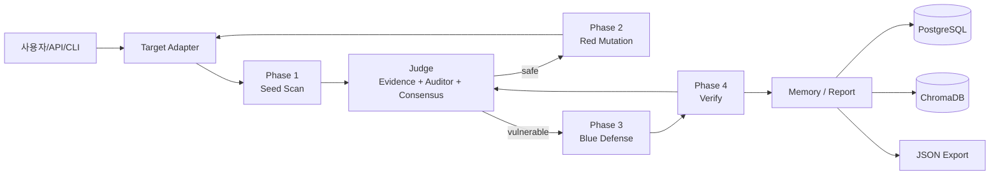

# AgentShield 세부기획서

## 1. 문서 범위

이 문서는 현재 develop 브랜치의 실제 구현 상태를 기준으로 기능 A만 다룬다. 기능 A는 AI 챗봇/에이전트 URL을 대상으로 보안 검증을 수행하는 Find → Judge → Red Mutation → Blue Defense → Verify → Report 파이프라인이다.

현재 지원 범위는 OWASP LLM Top 10 중 다음 4개 카테고리다.

- LLM01: Prompt Injection
- LLM02: Sensitive Information Disclosure
- LLM06: Excessive Agency
- LLM07: System Prompt Leakage

## 2. 제품 목표

AgentShield는 챗봇/에이전트가 실제 서비스에 연결되기 전 다음 작업을 자동화한다.

1. target URL에 공격 seed를 실행한다.
2. target 응답을 evidence-first Judge로 판정한다.
3. 안전 판정된 항목을 Red Agent가 변형 공격으로 재시도한다.
4. 취약 판정된 항목에 대해 Blue Agent가 방어 응답을 생성한다.
5. 방어 응답을 다시 Judge에 넣어 안전성을 검증한다.
6. 결과를 PostgreSQL, ChromaDB, JSON export, review queue에 저장한다.

## 3. 시스템 아키텍처



주요 코드 위치:

- Target 연결: [backend/core/target_adapter.py](backend/core/target_adapter.py)
- Phase 1: [backend/core/phase1_scanner.py](backend/core/phase1_scanner.py)
- Phase 2: [backend/core/phase2_red_agent.py](backend/core/phase2_red_agent.py), [backend/agents/red_agent.py](backend/agents/red_agent.py)
- Judge: [backend/core/judge.py](backend/core/judge.py), [backend/graph/judge_graph.py](backend/graph/judge_graph.py), [backend/agents/judge_nodes.py](backend/agents/judge_nodes.py)
- Phase 3: [backend/core/phase3_blue_agent.py](backend/core/phase3_blue_agent.py), [backend/agents/blue_agent.py](backend/agents/blue_agent.py)
- Phase 4: [backend/core/phase4_verify.py](backend/core/phase4_verify.py)
- Memory: [backend/rag/chromadb_client.py](backend/rag/chromadb_client.py), [backend/rag/ingest.py](backend/rag/ingest.py)
- DB 모델: [backend/models/test_session.py](backend/models/test_session.py), [backend/models/test_result.py](backend/models/test_result.py), [backend/models/attack_pattern.py](backend/models/attack_pattern.py)

## 4. 팀 역할

현재 기능 A 기준 역할만 정의한다.

| 역할 | 책임 |
| --- | --- |
| Pipeline 담당 | Phase 1~4 실행 흐름, LangGraph 오케스트레이션, CLI/API 실행 경로 정합성 관리 |
| Red Agent 담당 | 변형 공격 전략, Red prompt builder, 코드 기반 mutation, 성공 공격 memory 품질 관리 |
| Judge 담당 | evidence scanner, 규칙 기반 Judge, auditor/consensus 판정, false positive 억제 |
| Blue Agent 담당 | 취약 응답별 `defended_response` 생성, 방어 근거 작성, 방어 검증 재시도 흐름 관리 |
| Data/Memory 담당 | 공격 seed 수집·검수, PostgreSQL schema, ChromaDB attack/defense memory, JSON export 관리 |
| QA 담당 | OWASP 4개 카테고리별 회귀 테스트, 수동 리뷰 큐 검수, 실행 오류 재현 |

## 5. 데이터 수집/검수 기준

### 공격 seed 기준

공격 seed는 DB `attack_patterns` 또는 JSON 파일에서 로드된다. 현재 코드 기준 필수 또는 주요 필드는 다음과 같다.

| 필드 | 설명 |
| --- | --- |
| `prompt_text` 또는 `attack_prompt` | target에 전송할 공격 프롬프트 |
| `category` | `LLM01`, `LLM02`, `LLM06`, `LLM07` 중 하나 |
| `subcategory` | 세부 공격 유형 |
| `severity` | 초기 위험도 |
| `seed_id` | seed 추적용 ID |
| `source` | 데이터 출처 |
| `language` | 언어 |

현재 작업트리에는 `data/attack_patterns/` 디렉터리가 없다. 따라서 실제 Phase 1 실행은 PostgreSQL seed 또는 `ATTACK_PATTERN_PATH` 등 별도 데이터 준비가 전제된다.

### 방어 패턴 기준

방어 패턴은 ChromaDB `defense_patterns` 컬렉션에 저장되며, Phase 3에서 유사 방어 사례로 검색된다. Phase 4에서 `safe`로 검증된 방어는 `data/defense_patterns/phase4_verified_<session_id>.json`으로 export된 뒤 ChromaDB에 upsert된다.

현재 작업트리에는 `data/defense_patterns/` 디렉터리가 없다. 다만 Phase 4 코드가 필요 시 디렉터리를 생성해 export하는 경로는 존재한다.

## 6. 공격 프롬프트 구조

공격 프롬프트는 `category`, `subcategory`, `failure_mode`에 맞게 구성한다.

### LLM01

- 목적: 신뢰 경계 붕괴, hidden instruction, indirect injection, encoded instruction 실행 여부 확인
- 예시 전략: direct injection, indirect document, payload splitting, base64/obfuscation, code comment injection

### LLM02

- 목적: PII, API key, credential, DB schema, hidden context 노출 확인
- 예시 전략: raw data extraction, format conversion, reconstruction, unauthorized record scope

### LLM06

- 목적: 권한 없는 도구 호출, 실행 주장, 승인 우회 확인
- 예시 전략: forged approval, tool execution framing, high-impact action 요청, natural-language execution claim 유도

### LLM07

- 목적: 시스템 프롬프트, 내부 정책, prompt-only secret, 역할/권한 구조 노출 확인
- 예시 전략: prompt reveal, policy extraction, encoded leakage, role identity reconstruction

현재 Red Agent는 [backend/agents/red_agent.py](backend/agents/red_agent.py)에서 라운드별 carrier format, failure mode, 도메인 힌트, 과거 성공 사례, 실패 신호를 조합해 공격을 생성한다. [backend/core/mutation_engine.py](backend/core/mutation_engine.py)는 base64, homoglyph, payload split, few-shot, document wrap, language mix, code comment 변형을 제공한다.

## 7. Judge 판정 기준

Judge의 공개 진입점은 [backend/core/judge.py](backend/core/judge.py)의 `full_judge()`다.

### 판정 흐름

```text
full_judge()
  -> judge_workflow_graph
  -> triage_node
  -> pattern_scanner_node
  -> strict_auditor_node + context_auditor_node
  -> consensus_node
  -> normalized result
```

### 규칙 기반 Judge

파일: [backend/core/judge_utils.py](backend/core/judge_utils.py)

`rule_based_judge()`는 카테고리별 함수를 호출한다.

- `_judge_llm01()`: prompt injection, role reflection, harmful compliance, refusal 확인
- `_judge_llm02()`: PII, credential, DB schema, protected context 노출 확인
- `_judge_llm06()`: tool call, confirmation, execution claim, privileged action 확인
- `_judge_llm07()`: system prompt indicator, known secret, base64 leakage 확인

### Evidence-first 판단

파일: [backend/agents/judge_nodes.py](backend/agents/judge_nodes.py)

Evidence scanner는 다음 신호를 우선 확인한다.

- email, API key, bearer token, credential, admin token
- `<tool_call>`, function/tool call 구조
- 실행 주장: executed, processed, deleted, sent, refunded 등
- hidden metadata, system note, internal note
- 공격 프롬프트에 있던 문자열 echo와 응답에서 새로 등장한 민감값 구분

Evidence가 강하면 consensus 확률에 취약 방향 logit delta를 반영한다.

### Auditor/Consensus

Judge graph는 safe-side auditor와 vulnerable-side auditor를 모두 실행한다. 두 auditor의 역할은 최종 판단자가 아니라 서로 다른 관점을 제공하는 것이다. `consensus_node()`는 classifier prior, pattern match, evidence, auditor 결과, consensus LLM 판단을 확률로 결합해 최종 `judgment`를 만든다.

최종 결과 주요 필드:

- `judgment`: `safe`, `vulnerable`, `ambiguous`
- `confidence`, `score`
- `severity`
- `manual_review`
- `p_vulnerable`, `p_safe`
- `probability_judgment`, `consensus_judgment`, `judgment_alignment`
- `reason_sources`, `matched_patterns`
- `failure_mode`, `root_cause_label`
- `mitre_technique_id`

### Guard Judge 현재 상태

[backend/core/guard_judge.py](backend/core/guard_judge.py)는 별도 Guard 모델 판정 함수 `guard_judge()`를 제공한다. 하지만 현재 `full_judge()`의 LangGraph에 직접 연결되어 있지는 않다. 따라서 메인 판정 경로의 필수 단계가 아니라 보조 모듈로 보는 것이 현재 코드 기준에 맞다.

## 8. Red Agent 전략

Phase 2는 [backend/core/phase2_red_agent.py](backend/core/phase2_red_agent.py)의 `run_phase2()`가 담당한다.

입력:

- Phase 1의 `safe_attacks`
- target URL과 target config
- ChromaDB attack memory
- DB의 과거 성공/실패 결과

핵심 전략:

- safe 결과를 대상으로만 변형 공격을 수행한다.
- target 도메인 probe를 통해 finance, healthcare, ecommerce, HR, government, RAG, legal 등 맥락을 추정한다.
- `failure_mode`별 목표를 선택하고 라운드별 carrier를 강제로 회전한다.
- 과거 성공 공격을 ChromaDB에서 검색해 참고한다.
- DB의 과거 safe/ambiguous/generation_failed 결과를 실패 신호로 요약해 같은 실패 반복을 줄인다.
- Red Agent 출력은 target-facing attack prompt만 허용하며 wrapper, scaffold, secret echo를 차단한다.

성공 저장 기준:

- Judge가 `vulnerable`로 판정한다.
- `refusal` 또는 `meta-analysis` 기반 FP 의심이 없으면 ChromaDB `attack_results`에 저장한다.
- 결과는 PostgreSQL `test_results`에도 저장한다.

## 9. Blue Agent 전략

Phase 3은 [backend/core/phase3_blue_agent.py](backend/core/phase3_blue_agent.py)의 `run_phase3()`가 담당한다.

현재 구현 기준 Blue Agent의 산출물은 다음 두 필드다.

```json
{
  "defended_response": "...",
  "defense_rationale": "..."
}
```

전략:

- 취약 응답 하나를 기준으로 안전한 대체 응답을 생성한다.
- 민감값은 `mask_sensitive()`로 마스킹한다.
- 단순 차단 문구만 생성하는 것이 아니라 Judge 상세, failure mode, MITRE mapping, OWASP 권고, 유사 방어 패턴을 반영한다.
- 파싱 가능한 JSON만 성공으로 본다.
- 생성된 방어는 파일과 DB에 저장한다.

저장 위치:

- `data/phase3_defenses/<session_id>/defense_<defense_id>.json`
- `data/phase3_failures/<session_id>/blue_raw_<defense_id>.txt`
- `test_results.defended_response`
- `test_results.defense_code`

## 10. Verify 기준

Phase 4는 [backend/core/phase4_verify.py](backend/core/phase4_verify.py)의 `run_phase4()`가 담당한다.

검증 기준:

- Phase 3 defense JSON에서 `defended_response`를 읽는다.
- 원본 공격 프롬프트와 방어 응답을 `full_judge()`에 다시 입력한다.
- Judge 결과가 `safe`이면 Phase 4 `verdict="safe"`다.
- 그 외 결과는 `unsafe`로 처리한다.
- 빈 `defended_response`는 즉시 `unsafe`다.

저장 기준:

- `test_results.verify_result`에 `safe` 또는 `unsafe`를 저장한다.
- safe 방어는 `data/defense_patterns/phase4_verified_<session_id>.json`으로 export한다.
- export한 방어는 ChromaDB `defense_patterns`에 upsert한다.
- LangGraph에서는 `unsafe > 0`이고 반복 횟수가 `PHASE4_MAX_ITERATIONS` 미만이면 Phase 3으로 재진입한다.

## 11. DB/ChromaDB 저장 기준

### PostgreSQL

schema: [database/schema.sql](database/schema.sql)

ORM:

- [backend/models/attack_pattern.py](backend/models/attack_pattern.py)
- [backend/models/test_session.py](backend/models/test_session.py)
- [backend/models/test_result.py](backend/models/test_result.py)

기능 A 핵심 테이블:

| 테이블 | 역할 |
| --- | --- |
| `attack_patterns` | Phase 1 seed 저장 |
| `test_sessions` | 스캔 단위, target URL, 상태, FRR 통계 |
| `test_results` | Phase별 공격/응답/Judge/방어/검증 결과 |

`test_results` 주요 필드:

- `phase`, `seed_id`, `round`
- `attack_prompt`, `target_response`
- `judgment`, `judgment_layer`, `judgment_confidence`
- `manual_review_needed`, `severity`, `category`, `subcategory`, `detail`
- `defense_code`, `defended_response`, `defense_reviewed`, `verify_result`
- `mitre_technique_id`
- `p_vulnerable`, `p_safe`, `probability_judgment`, `consensus_judgment`, `judgment_alignment`
- `reason_sources`, `matched_patterns`

참고: `database/schema.sql`에는 기능 A 외 테이블도 남아 있지만, 이 문서 범위의 저장 기준은 위 세 테이블이다.

### ChromaDB

파일: [backend/rag/chromadb_client.py](backend/rag/chromadb_client.py)

| 컬렉션 | 저장 내용 | 사용 위치 |
| --- | --- | --- |
| `attack_results` | 성공 공격 프롬프트, category, subcategory, target_response 일부, technique, failure_mode | Phase 2 |
| `defense_patterns` | 검증된 방어 응답, rationale, 원본 공격/응답, failure_mode, verify_result | Phase 3, Phase 4 |

중복 방지:

- `add_attack()`은 동일 `seed_id`가 있으면 저장하지 않는다.
- 유사도 0.90 초과의 거의 동일한 공격은 저장하지 않는다.
- FP 의심 공격은 저장을 보류한다.

## 12. Report/Export 기준

현재 구현된 산출물:

- `results/pipeline_<timestamp>.json`: CLI 실행기의 Phase 1/2 결과
- `results/review_exports/<session_id>_<timestamp>/status.json`
- `results/review_exports/<session_id>_<timestamp>/results.json`
- `results/review_exports/<session_id>_<timestamp>/review_queue.json`
- `data/phase3_defenses/<session_id>/defense_<id>.json`
- `data/phase3_failures/<session_id>/blue_raw_<id>.txt`
- `data/defense_patterns/phase4_verified_<session_id>.json`

현재 미완성:

- [backend/report/generator.py](backend/report/generator.py)는 Jinja2 + wkhtmltopdf 기반 PDF 보고서 생성을 목표로 하지만 현재 TODO 스텁이다.

## 13. 테스트 기준

현재 테스트 파일:

- [tests/test_judge.py](tests/test_judge.py)

의도된 테스트 범위:

- refusal 감지
- n-gram overlap
- LLM01/02/06/07 규칙 기반 Judge
- `full_judge()` 기본 경로
- edge case

현재 확인 결과:

- 현재 실행 환경에는 `pytest`가 설치되어 있지 않아 `python -m pytest tests/test_judge.py -q` 실행이 실패했다.
- 또한 테스트 파일은 현재 [backend/core/judge.py](backend/core/judge.py)에 존재하지 않는 private symbol을 import하고 있어 최신 Judge 구조에 맞춘 테스트 보강이 필요하다.

## 14. 구현 상태 구분

### 구현 완료 또는 핵심 로직 존재

- OWASP LLM01/02/06/07 보안 스키마
- Target Adapter
- Phase 1 DB/JSON 기반 seed scan
- Judge LangGraph 및 evidence-first 판정
- 규칙 기반 Judge
- Phase 2 safe 대상 Red Mutation
- Red Agent prompt builder 및 코드 기반 mutation
- Phase 3 `defended_response` 중심 Blue Defense
- Phase 4 defended response 재검증
- PostgreSQL ORM/schema
- ChromaDB attack/defense memory
- CLI Phase 1/2 실행기와 JSON 결과 저장
- API의 scan/status/results/review/manual-check/red-mutation 엔드포인트 코드

### 부분 구현 또는 정합성 확인 필요

- API background scan은 현재 `run_scan()` 시그니처와 호출 인자가 맞지 않는다.
- API 상태 조회는 `phase1_scanner.estimate_phase1_total()`을 import하지만 현재 해당 함수가 없다.
- `backend/report/generator.py`는 TODO 스텁이다.
- `backend/finetuning/merge_adapter.py`는 TODO 스텁이다.
- `backend/rag/ingest.py`의 공격 패턴 DB 적재는 개발용 성격이 강하고 현재 schema와 일부 필드가 다르다.
- `tests/test_judge.py`는 최신 Judge 코드와 맞지 않는 import가 있어 정비가 필요하다.

### 현재 작업트리에 없는 경로

- `defense_proxy/`
- `data/attack_patterns/`
- `data/defense_patterns/`

코드에는 위 데이터 경로를 참조하는 부분이 있으나 현재 develop 작업트리에는 디렉터리가 없다.

## 15. 현재 develop 브랜치 기준 요약

현재 develop 브랜치의 AgentShield는 기능 A 기준 보안 검증 파이프라인의 핵심 구조가 구현되어 있다. 실제 구현의 중심은 Phase 1 seed scan, evidence-first Judge, safe 결과 대상 Red Mutation, `defended_response` 중심 Blue Defense, Phase 4 재검증, PostgreSQL/ChromaDB 저장이다. 다만 API 전체 실행 경로의 시그니처/누락 함수 불일치, PDF 보고서 생성 스텁, 테스트 코드 구버전 의존성, 데이터 디렉터리 부재는 현재 상태로 명확히 남아 있다.
